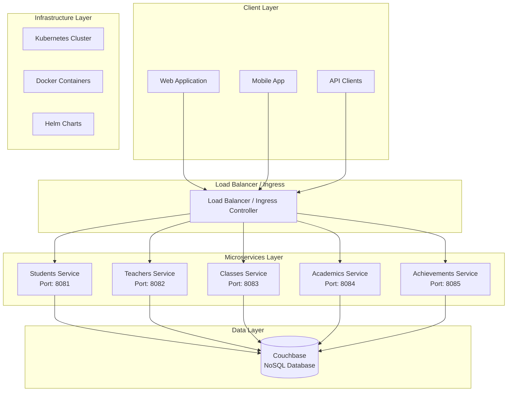

# School Microservice - High-Level Design Document

## Document Information
- **Project**: School Microservice System
- **Version**: 1.2.0
- **Date**: August 21, 2025
- **Author**: GitHub Copilot (AI Generated)
- **Status**: Active Development

---

## Executive Summary

The School Microservice System is a cloud-native, domain-oriented microservice architecture designed to manage comprehensive school operations. The system follows modern software engineering principles including containerization, orchestration, and scalable design patterns to provide a robust educational management platform.

### Key Features
- **Domain-Driven Design**: Five independent microservices managing distinct business domains
- **Cloud-Native Architecture**: Kubernetes-ready with Helm charts and Docker containers
- **Scalable Infrastructure**: Horizontal pod autoscaling and load balancing capabilities
- **Security-First Approach**: Non-root containers, network policies, and minimal attack surface
- **Production-Ready**: Comprehensive monitoring, health checks, and deployment automation

---

## System Architecture

### Architecture Overview



### Service Architecture Principles

#### 1. Domain-Oriented Design
Each microservice owns a specific business domain:
- **Students Service**: Student enrollment, profiles, and lifecycle management
- **Teachers Service**: Faculty management, assignments, and profiles
- **Classes Service**: Course management, scheduling, and enrollment
- **Academics Service**: Grade management, assessments, and academic records
- **Achievements Service**: Awards, recognitions, and achievement tracking

#### 2. Bounded Contexts
- Each service maintains its own data model and business logic
- Inter-service communication through well-defined APIs
- Database-per-service pattern with shared Couchbase cluster
- Eventual consistency model for cross-service data

#### 3. Technology Stack
- **Programming Language**: Go 1.21 (performance, concurrency, cloud-native support)
- **Database**: Couchbase Community 7.2.0 (JSON document store, scalability)
- **Container Runtime**: Docker with distroless/Alpine base images
- **Orchestration**: Kubernetes with Helm 3.x
- **HTTP Framework**: Gorilla Mux (routing, middleware support)

---

## Service Design Details

### 1. Students Service

#### Responsibilities
- Student registration and enrollment management
- Student profile and demographic information
- Student lifecycle tracking (active, inactive, graduated)
- Contact information and address management

#### Key Features
- Auto-generated student IDs with timestamp-based uniqueness
- Concurrency-safe operations with context support
- Input validation and data sanitization
- Audit trail with creation and update timestamps

#### Data Model
```go
type Student struct {
    ID          string    // Primary key: STU{timestamp}
    FirstName   string    // Required field
    LastName    string    // Required field
    Email       string    // Unique identifier, validation required
    DateOfBirth time.Time // Age calculation support
    Grade       string    // Current grade level
    Address     string    // Contact information
    Phone       string    // Contact information
    EnrollDate  time.Time // Auto-set on creation
    Status      string    // Lifecycle management
    CreatedAt   time.Time // Audit trail
    UpdatedAt   time.Time // Audit trail
}
```

### 2. Teachers Service

#### Responsibilities
- Faculty and staff management
- Department and subject assignment tracking
- Compensation and employment information
- Contact and professional information

#### Key Features
- Department-based organization structure
- Salary and employment status tracking
- Professional profile management
- Subject specialization tracking

### 3. Classes Service

#### Responsibilities
- Course catalog management
- Class scheduling and room assignment
- Student enrollment tracking
- Teacher-class assignments

#### Key Features
- Maximum enrollment capacity enforcement
- Schedule conflict detection capabilities
- Multi-student enrollment support
- Semester and academic year organization

### 4. Academics Service

#### Responsibilities
- Grade and assessment management
- Academic performance tracking
- Exam and assignment record keeping
- GPA calculation support

#### Key Features
- Automatic letter grade calculation from numeric scores
- Multiple assessment type support (midterm, final, quiz, assignment)
- Teacher-student-class relationship tracking
- Academic year and semester organization

#### Grade Calculation Logic
```go
func calculateGrade(score, maxScore float64) string {
    percentage := (score / maxScore) * 100
    switch {
    case percentage >= 90:
        return "A"
    case percentage >= 80:
        return "B"
    case percentage >= 70:
        return "C"
    case percentage >= 60:
        return "D"
    default:
        return "F"
    }
}
```

### 5. Achievements Service

#### Responsibilities
- Student achievement and award tracking
- Recognition program management
- Achievement categorization and level management
- Approval workflow for achievement records

#### Key Features
- Multi-category achievement support (academic, sports, arts, community, leadership)
- Achievement level hierarchy (school, district, state, national, international)
- Points-based achievement system
- Certificate document management
- Approval workflow with status tracking

---

## Data Architecture

### Database Design

#### Couchbase NoSQL Strategy
- **Document-based storage**: Natural fit for complex nested data structures
- **Horizontal scalability**: Built-in clustering and replication
- **JSON-native**: Direct mapping from Go structs to database documents
- **N1QL queries**: SQL-like query language for complex operations

#### Data Organization
```
Bucket: school
├── Collections:
│   ├── students/
│   ├── teachers/
│   ├── classes/
│   ├── academics/
│   └── achievements/
```

#### Key Design Patterns
- **Document keys**: Service-specific prefixes (STU_, TCH_, CLS_, ACD_, ACH_)
- **Timestamp-based IDs**: Ensures uniqueness and provides creation order
- **Embedded references**: Foreign key relationships stored as string references
- **Audit fields**: CreatedAt and UpdatedAt timestamps for all entities

### Data Consistency Model

#### Within Service Boundaries
- **ACID compliance**: Strong consistency within single service operations
- **Transaction support**: Couchbase ACID transactions for multi-document operations
- **Optimistic locking**: Using document CAS (Compare-And-Swap) values

#### Cross-Service Consistency
- **Eventual consistency**: Asynchronous propagation of reference data changes
- **Compensation patterns**: Rollback mechanisms for failed cross-service operations
- **Reference integrity**: Application-level foreign key validation

---

## Infrastructure Design

### Containerization Strategy

#### Docker Multi-Stage Builds
```dockerfile
# Stage 1: Build environment
FROM golang:1.21-alpine AS builder
# ... build process ...

# Stage 2: Runtime environment  
FROM alpine:3.18
# ... minimal runtime setup ...
```

#### Security Hardening
- **Non-root user execution**: UID/GID 1001 for all containers
- **Read-only root filesystem**: Prevents runtime file system modifications
- **Minimal base images**: Alpine 3.18 or distroless for reduced attack surface
- **Health check endpoints**: Container health monitoring
- **Signal handling**: Graceful shutdown support

### Kubernetes Architecture

#### Namespace Design
```yaml
apiVersion: v1
kind: Namespace
metadata:
  name: school-demo
  labels:
    app.kubernetes.io/name: school-microservice
    environment: development
```

#### Deployment Strategy
- **Rolling updates**: Zero-downtime deployments
- **Resource limits**: CPU and memory constraints for stability
- **Horizontal Pod Autoscaler**: Automatic scaling based on metrics
- **Pod Disruption Budget**: High availability during maintenance

#### Service Mesh Considerations
- **Service-to-service communication**: HTTP/REST APIs
- **Load balancing**: Kubernetes native service load balancing
- **Circuit breaker pattern**: Future implementation for resilience
- **Service discovery**: Kubernetes DNS-based discovery

### Helm Chart Architecture

#### Template Organization
```
helm/school-microservice/
├── Chart.yaml                 # Chart metadata
├── values.yaml               # Default configuration
├── values-development.yaml   # Development overrides
├── values-production.yaml    # Production overrides
└── templates/
    ├── deployment.yaml       # Service deployments
    ├── service.yaml         # Service definitions
    ├── ingress.yaml         # External access
    ├── hpa.yaml            # Auto-scaling
    ├── pdb.yaml            # Disruption budgets
    ├── networkpolicy.yaml  # Network security
    └── servicemonitor.yaml # Monitoring
```

#### Multi-Environment Support
- **Environment-specific values**: Separate configuration files per environment
- **Resource scaling**: Different CPU/memory allocations per environment
- **Feature toggles**: Environment-specific feature enablement
- **Security policies**: Stricter policies for production environments

---

## Security Architecture

### Container Security

#### Image Security
- **Distroless base images**: Minimal attack surface with no shell access
- **Vulnerability scanning**: Automated image scanning in CI/CD pipeline
- **Image signing**: Container image integrity verification
- **Regular updates**: Automated base image updates

#### Runtime Security
- **Non-root execution**: All containers run as unprivileged user
- **Read-only filesystem**: Prevents runtime tampering
- **Capability dropping**: Minimal Linux capabilities
- **Security contexts**: Kubernetes security context enforcement

### Network Security

#### Kubernetes Network Policies
```yaml
apiVersion: networking.k8s.io/v1
kind: NetworkPolicy
metadata:
  name: school-microservice-netpol
spec:
  podSelector:
    matchLabels:
      app.kubernetes.io/name: school-microservice
  policyTypes:
  - Ingress
  - Egress
  ingress:
  - from:
    - namespaceSelector:
        matchLabels:
          name: school-demo
    ports:
    - protocol: TCP
      port: 8081-8085
```

#### Service Communication
- **TLS encryption**: HTTPS/TLS for all external communication
- **Internal communication**: HTTP over private networks (future: mTLS)
- **API rate limiting**: Protection against abuse and DoS attacks
- **Input validation**: Comprehensive request validation and sanitization

### Data Security

#### Database Security
- **Authentication**: Username/password authentication for database access
- **Authorization**: Role-based access control (RBAC) for database operations
- **Encryption at rest**: Couchbase data encryption capabilities
- **Encryption in transit**: TLS for database connections
- **Audit logging**: Database access and modification tracking

#### Application Security
- **Input sanitization**: Prevention of injection attacks
- **Error handling**: Secure error messages without information disclosure
- **Logging security**: No sensitive data in application logs
- **Secret management**: Kubernetes secrets for sensitive configuration

---

## Scalability Design

### Horizontal Scaling

#### Pod-Level Scaling
```yaml
apiVersion: autoscaling/v2
kind: HorizontalPodAutoscaler
metadata:
  name: students-hpa
spec:
  scaleTargetRef:
    apiVersion: apps/v1
    kind: Deployment
    name: students
  minReplicas: 2
  maxReplicas: 10
  metrics:
  - type: Resource
    resource:
      name: cpu
      target:
        type: Utilization
        averageUtilization: 70
```

#### Database Scaling
- **Couchbase clustering**: Multi-node database clusters
- **Data distribution**: Automatic data partitioning across nodes
- **Read replicas**: Read-only replicas for query load distribution
- **Connection pooling**: Efficient database connection management

### Performance Optimization

#### Application Level
- **Context-aware operations**: Timeout and cancellation support
- **Streaming responses**: Memory-efficient large data set handling
- **Response caching**: HTTP cache headers for appropriate endpoints
- **Goroutine management**: Efficient concurrency patterns

#### Infrastructure Level
- **Resource requests/limits**: Appropriate CPU and memory allocation
- **Pod placement**: Node affinity and anti-affinity rules
- **Persistent volumes**: High-performance storage for database
- **Network optimization**: Service mesh for efficient inter-service communication

---

## Monitoring and Observability

### Health Monitoring

#### Application Health
```go
// Health check endpoint implementation
func (h *HealthHandler) Health(w http.ResponseWriter, r *http.Request) {
    health := map[string]interface{}{
        "status":    "healthy",
        "timestamp": time.Now(),
        "service":   "students-service",
        "version":   "1.2.0",
        "database":  h.checkDatabaseHealth(),
    }
    json.NewEncoder(w).Encode(health)
}
```

#### Infrastructure Health
- **Kubernetes probes**: Liveness and readiness probes for all services
- **Pod health monitoring**: Automatic pod restart on health check failures
- **Service health aggregation**: Overall system health status
- **Database health checks**: Connection and query performance monitoring

### Metrics and Logging

#### Application Metrics
- **Request metrics**: Response times, error rates, throughput
- **Business metrics**: Active users, enrollment numbers, grade distributions
- **System metrics**: Memory usage, CPU utilization, goroutine counts
- **Database metrics**: Query performance, connection pool status

#### Logging Strategy
```go
// Structured logging example
log.Info("Student created",
    zap.String("studentId", student.ID),
    zap.String("grade", student.Grade),
    zap.Duration("processingTime", time.Since(start)),
)
```

#### Monitoring Integration
- **Prometheus metrics**: ServiceMonitor for metrics collection
- **Grafana dashboards**: Visual monitoring and alerting
- **ELK stack**: Centralized logging and log analysis
- **Jaeger tracing**: Distributed tracing for request flow analysis

---

## Deployment Architecture

### CI/CD Pipeline

#### Build Process
1. **Source control**: Git-based version control
2. **Code quality**: Automated testing and linting
3. **Security scanning**: Vulnerability and secret scanning
4. **Container building**: Multi-stage Docker builds
5. **Image scanning**: Container security assessment
6. **Artifact storage**: Container registry with image signing

#### Deployment Process
1. **Environment validation**: Target environment health checks
2. **Configuration management**: Environment-specific configurations
3. **Blue-green deployment**: Zero-downtime deployment strategy
4. **Health verification**: Post-deployment health checks
5. **Rollback capability**: Automated rollback on failure detection

### Environment Strategy

#### Development Environment
- **Single node**: Minimal resource allocation
- **Debug mode**: Enhanced logging and debugging features
- **Mock dependencies**: Simplified external service integration
- **Fast feedback**: Rapid deployment and testing cycles

#### Staging Environment
- **Production replica**: Similar configuration to production
- **Full integration**: Real external service integration
- **Performance testing**: Load and stress testing
- **Security validation**: Penetration testing and security scans

#### Production Environment
- **High availability**: Multi-zone deployment with redundancy
- **Performance optimization**: Production-tuned resource allocation
- **Security hardening**: Full security controls and monitoring
- **Backup and recovery**: Automated backup and disaster recovery

---

## Future Enhancements

### Phase 2 Roadmap

#### Security Enhancements
- **JWT authentication**: Token-based authentication system
- **OAuth 2.0 integration**: Third-party authentication providers
- **Role-based access control**: Fine-grained permission system
- **API rate limiting**: Advanced throttling and quota management

#### Feature Enhancements
- **Real-time notifications**: WebSocket-based event streaming
- **Advanced reporting**: Analytics and business intelligence
- **Mobile app support**: Native mobile application APIs
- **Integration APIs**: Third-party system integration capabilities

#### Technical Improvements
- **Service mesh**: Istio/Linkerd for advanced traffic management
- **Event-driven architecture**: Asynchronous event processing
- **CQRS pattern**: Command Query Responsibility Segregation
- **GraphQL APIs**: Flexible query capabilities for frontend clients

### Scalability Roadmap

#### Infrastructure Scaling
- **Multi-region deployment**: Geographic distribution for global access
- **CDN integration**: Content delivery network for static assets
- **Database sharding**: Horizontal database scaling strategies
- **Microservice decomposition**: Further domain subdivision as needed

#### Performance Optimization
- **Caching layers**: Redis/Memcached for application-level caching
- **Database optimization**: Query optimization and indexing strategies
- **Connection pooling**: Advanced connection management
- **Load testing**: Continuous performance validation

---

## Risk Assessment and Mitigation

### Technical Risks

#### Database Risks
- **Risk**: Single point of failure in database cluster
- **Mitigation**: Multi-node Couchbase cluster with automatic failover
- **Monitoring**: Database health monitoring and alerting

#### Security Risks
- **Risk**: Container vulnerabilities and security exploits
- **Mitigation**: Regular security scanning, minimal base images, security policies
- **Monitoring**: Continuous vulnerability assessment and patch management

#### Performance Risks
- **Risk**: Service degradation under high load
- **Mitigation**: Horizontal pod autoscaling, resource limits, load testing
- **Monitoring**: Performance metrics and alerting thresholds

### Operational Risks

#### Deployment Risks
- **Risk**: Failed deployments causing service downtime
- **Mitigation**: Blue-green deployment, automated rollback, health checks
- **Monitoring**: Deployment success metrics and alerting

#### Data Risks
- **Risk**: Data loss or corruption
- **Mitigation**: Regular backups, database replication, transaction logging
- **Monitoring**: Data integrity checks and backup verification

---

## Conclusion

The School Microservice System represents a modern, cloud-native approach to educational management software. The architecture emphasizes scalability, security, and maintainability while providing a solid foundation for future enhancements.

### Key Architectural Benefits
1. **Domain-driven design** enables focused development and maintenance
2. **Microservice architecture** provides independent scaling and deployment
3. **Container-first approach** ensures consistent deployment across environments
4. **Kubernetes orchestration** provides enterprise-grade infrastructure management
5. **Security-first mindset** incorporates security at every architectural layer

### Success Metrics
- **Scalability**: Support for 10,000+ concurrent users
- **Availability**: 99.9% uptime with automated failover
- **Performance**: Sub-200ms response times for API calls
- **Security**: Zero critical security vulnerabilities
- **Maintainability**: <24 hour deployment cycle for new features

The system is designed to evolve with changing requirements while maintaining architectural integrity and operational excellence.
