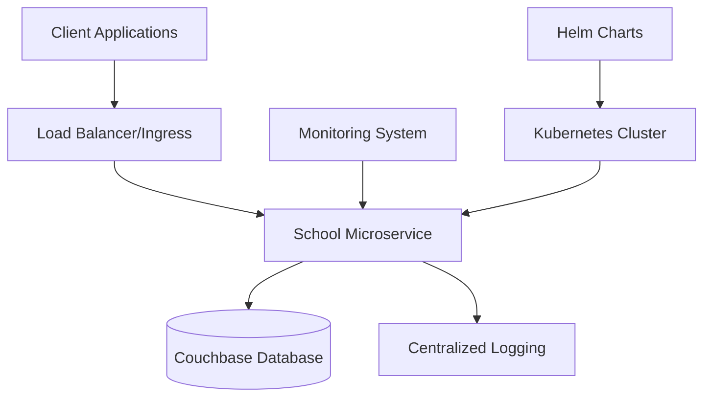
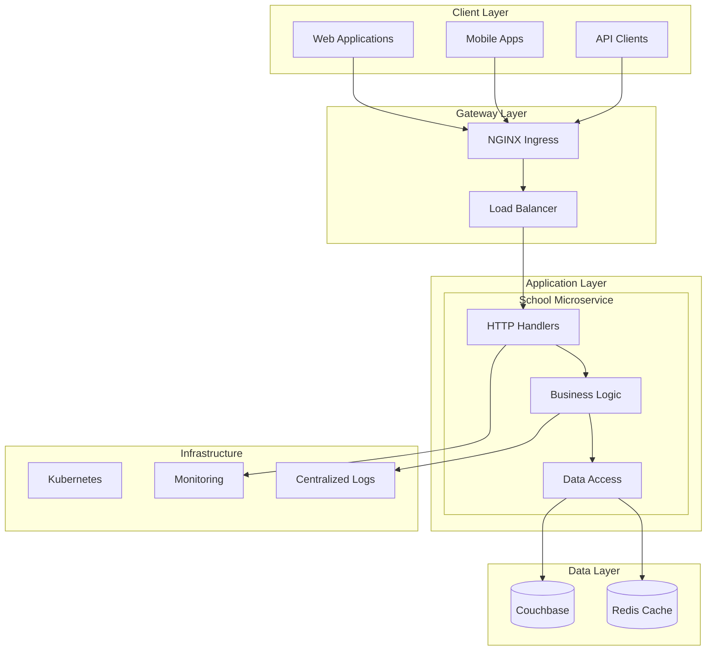
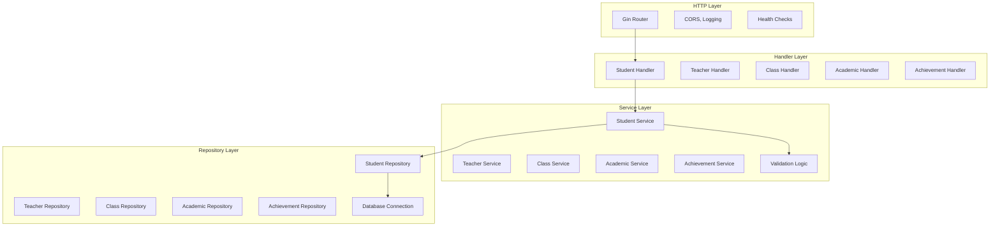
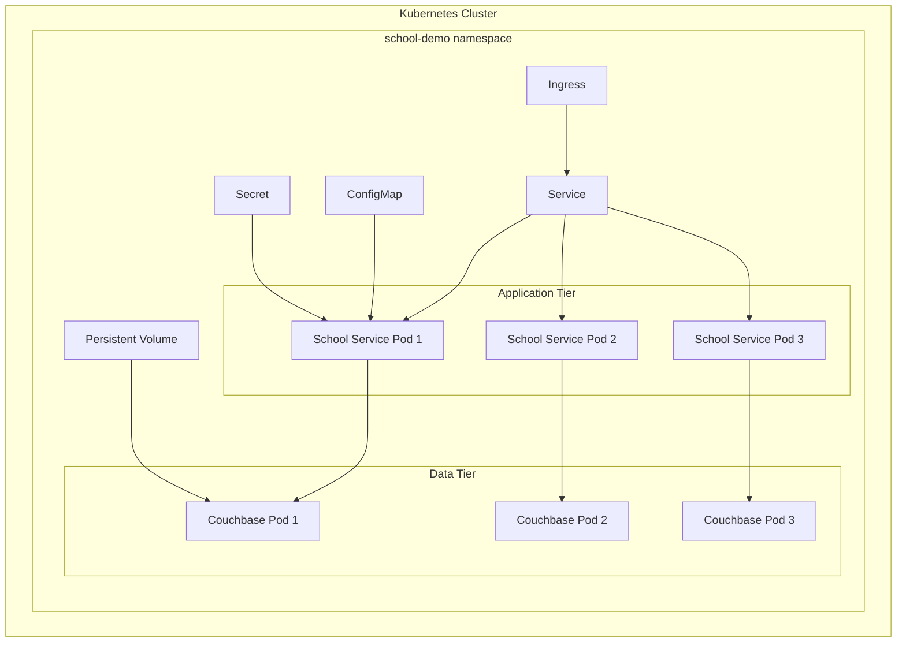

# School Management Microservice - High Level Design Document

<!-- [AI GENERATED] LLM: GitHub Copilot, Mode: Chat, Date: 2025-09-24 -->

## Table of Contents

- [1. Executive Summary](#1-executive-summary)
- [2. System Overview](#2-system-overview)
- [3. Architecture Design](#3-architecture-design)
- [4. Component Design](#4-component-design)
- [5. Data Design](#5-data-design)
- [6. API Design](#6-api-design)
- [7. Security Design](#7-security-design)
- [8. Deployment Architecture](#8-deployment-architecture)
- [9. Scalability & Performance](#9-scalability--performance)
- [10. Monitoring & Observability](#10-monitoring--observability)
- [11. Technical Decisions](#11-technical-decisions)
- [12. Future Enhancements](#12-future-enhancements)

## 1. Executive Summary

The School Management Microservice is a RESTful API service designed to manage core school data including students, teachers, classes, academic records, and achievements. Built with modern Go practices and cloud-native principles, the service provides a scalable, secure, and maintainable solution for educational institutions.

### Key Features
- **RESTful API** with comprehensive student management
- **Clean Architecture** with clear separation of concerns
- **Couchbase Integration** for NoSQL document storage
- **Kubernetes Ready** with Helm charts and monitoring
- **Security Hardened** with non-root containers and network policies
- **Horizontally Scalable** with stateless design

### Technology Stack
- **Language:** Go 1.20
- **Framework:** Gin HTTP Framework
- **Database:** Couchbase Community 7.2.0
- **Containerization:** Docker with distroless images
- **Orchestration:** Kubernetes with Helm
- **Monitoring:** Prometheus & Grafana

## 2. System Overview

### 2.1 System Context



### 2.2 Business Domain

The system manages five core domain entities:

1. **Students** - Personal information, grades, contact details
2. **Teachers** - Professional information, departments, subjects
3. **Classes** - Course information, schedules, capacity
4. **Academic Records** - Exam results, grades, assessments
5. **Achievements** - Awards, recognitions, accomplishments

### 2.3 System Boundaries

**In Scope:**
- Student lifecycle management (CRUD operations)
- RESTful API with standard HTTP methods
- Data validation and business rules
- Pagination and filtering
- Health checks and monitoring endpoints

**Out of Scope:**
- Authentication and authorization (planned for v2)
- File upload/document management
- Real-time notifications
- Reporting and analytics
- Integration with external systems

## 3. Architecture Design

### 3.1 High-Level Architecture



### 3.2 Clean Architecture Principles

The service follows Clean Architecture principles with clear dependency inversion:

```
┌─────────────────────────────────────┐
│           HTTP Layer                │  ← Frameworks & Drivers
├─────────────────────────────────────┤
│         Handler Layer               │  ← Interface Adapters
├─────────────────────────────────────┤
│        Business Logic               │  ← Use Cases
├─────────────────────────────────────┤
│         Domain Models               │  ← Entities
└─────────────────────────────────────┘
```

**Key Principles:**
- **Dependency Inversion:** Inner layers don't depend on outer layers
- **Single Responsibility:** Each layer has a distinct purpose
- **Interface Segregation:** Small, focused interfaces
- **Open/Closed Principle:** Open for extension, closed for modification

## 4. Component Design

### 4.1 Component Overview



### 4.2 Handler Layer Design

**Purpose:** HTTP request/response handling and routing

**Responsibilities:**
- HTTP request parsing and validation
- Route parameter extraction
- Response formatting and status codes
- Error handling and HTTP error mapping

**Key Components:**
```go
// StudentHandler handles all student-related HTTP endpoints
type StudentHandler struct {
    service service.StudentService
}

// Methods:
// - CreateStudent(c *gin.Context)     // POST /api/v1/students
// - GetStudent(c *gin.Context)        // GET /api/v1/students/:id
// - GetAllStudents(c *gin.Context)    // GET /api/v1/students
// - UpdateStudent(c *gin.Context)     // PUT /api/v1/students/:id
// - DeleteStudent(c *gin.Context)     // DELETE /api/v1/students/:id
// - GetStudentsByGrade(c *gin.Context) // GET /api/v1/students/grade/:grade
```

### 4.3 Service Layer Design

**Purpose:** Business logic implementation and validation

**Responsibilities:**
- Input validation and business rules enforcement
- Cross-cutting concerns (logging, metrics)
- Transaction management
- Business workflow orchestration

**Key Components:**
```go
// StudentService defines business operations for students
type StudentService interface {
    CreateStudent(ctx context.Context, req *models.CreateStudentRequest) (*models.Student, error)
    GetStudent(ctx context.Context, id string) (*models.Student, error)
    GetAllStudents(ctx context.Context, page, pageSize int) ([]*models.Student, int, error)
    UpdateStudent(ctx context.Context, id string, req *models.CreateStudentRequest) (*models.Student, error)
    DeleteStudent(ctx context.Context, id string) error
    GetStudentsByGrade(ctx context.Context, grade string) ([]*models.Student, error)
    GetStudentByEmail(ctx context.Context, email string) (*models.Student, error)
}
```

**Business Rules Implemented:**
- Email uniqueness validation
- Age validation (3-25 years)
- Grade validation (KG, 1-12)
- Phone number validation (minimum 10 digits)
- Required field validation

### 4.4 Repository Layer Design

**Purpose:** Data access abstraction and database operations

**Responsibilities:**
- Database connection management
- CRUD operations
- Query optimization
- Data mapping between domain models and database schemas

**Key Components:**
```go
// StudentRepository defines data access operations
type StudentRepository interface {
    Create(ctx context.Context, student *models.Student) error
    GetByID(ctx context.Context, id string) (*models.Student, error)
    GetAll(ctx context.Context, page, pageSize int) ([]*models.Student, int, error)
    Update(ctx context.Context, id string, student *models.Student) error
    Delete(ctx context.Context, id string) error
    GetByGrade(ctx context.Context, grade string) ([]*models.Student, error)
    GetByEmail(ctx context.Context, email string) (*models.Student, error)
}
```

## 5. Data Design

### 5.1 Data Model Overview

```mermaid
erDiagram
    STUDENT {
        string id PK
        string first_name
        string last_name
        string email UK
        datetime date_of_birth
        string grade
        string address
        string phone
        string parent_name
        string parent_phone
        datetime created_at
        datetime updated_at
    }
    
    TEACHER {
        string id PK
        string first_name
        string last_name
        string email UK
        string phone
        string department
        string subject
        int experience
        float salary
        datetime hire_date
        datetime created_at
        datetime updated_at
    }
    
    CLASS {
        string id PK
        string name
        string subject
        string teacher_id FK
        string grade
        string room
        string schedule
        int capacity
        int enrolled
        datetime created_at
        datetime updated_at
    }
    
    ACADEMIC {
        string id PK
        string student_id FK
        string class_id FK
        string exam_type
        string subject
        float max_marks
        float obt_marks
        string grade
        datetime exam_date
        string remarks
        datetime created_at
        datetime updated_at
    }
    
    ACHIEVEMENT {
        string id PK
        string student_id FK
        string title
        string description
        string category
        string level
        datetime date
        string awarded_by
        datetime created_at
        datetime updated_at
    }
    
    STUDENT_CLASS {
        string student_id FK
        string class_id FK
        datetime enrolled_at
    }
    
    TEACHER ||--o{ CLASS : teaches
    STUDENT ||--o{ ACADEMIC : has
    CLASS ||--o{ ACADEMIC : contains
    STUDENT ||--o{ ACHIEVEMENT : earns
    STUDENT ||--o{ STUDENT_CLASS : enrolled
    CLASS ||--o{ STUDENT_CLASS : contains
```

### 5.2 Database Schema Design

**Database Choice: Couchbase NoSQL**

**Rationale:**
- **Flexible Schema:** Supports evolving data models
- **Horizontal Scaling:** Built-in clustering and sharding
- **High Performance:** Memory-first architecture
- **JSON Documents:** Natural fit for Go structs
- **N1QL Support:** SQL-like query language

**Document Structure:**
```json
{
  "type": "student",
  "id": "student_12345",
  "first_name": "John",
  "last_name": "Doe",
  "email": "john.doe@example.com",
  "date_of_birth": "2010-05-15T00:00:00Z",
  "grade": "8",
  "address": "123 Main St, City, State",
  "phone": "1234567890",
  "parent_name": "Jane Doe",
  "parent_phone": "0987654321",
  "created_at": "2025-09-24T10:00:00Z",
  "updated_at": "2025-09-24T10:00:00Z"
}
```

### 5.3 Data Access Patterns

**Primary Queries:**
- Get student by ID (key-value lookup)
- Get all students with pagination (N1QL with OFFSET/LIMIT)
- Get students by grade (N1QL with WHERE clause)
- Get student by email (N1QL with WHERE clause)

**Index Strategy:**
```sql
-- Primary index for document keys
CREATE PRIMARY INDEX ON default

-- Secondary index for email lookups
CREATE INDEX idx_student_email ON default(email) WHERE type = "student"

-- Secondary index for grade queries
CREATE INDEX idx_student_grade ON default(grade) WHERE type = "student"
```

## 6. API Design

### 6.1 REST API Principles

**RESTful Design:**
- **Resource-based URLs:** `/api/v1/students/{id}`
- **HTTP Verbs:** GET, POST, PUT, DELETE
- **Stateless:** No session state stored on server
- **Standard Status Codes:** 200, 201, 400, 404, 500

**API Versioning:**
- **URL-based versioning:** `/api/v1/`
- **Backward compatibility:** Maintained across versions
- **Deprecation policy:** 6-month notice period

### 6.2 Response Format Standardization

**Standard Response Structure:**
```go
type APIResponse struct {
    Success bool        `json:"success"`         // Always present
    Message string      `json:"message"`         // Human-readable message
    Data    interface{} `json:"data,omitempty"`  // Response data
    Error   string      `json:"error,omitempty"` // Error details
}
```

**Pagination Support:**
```go
type PaginatedResponse struct {
    Success    bool        `json:"success"`
    Message    string      `json:"message"`
    Data       interface{} `json:"data,omitempty"`
    Total      int         `json:"total"`         // Total records
    Page       int         `json:"page"`          // Current page
    PageSize   int         `json:"page_size"`     // Page size
    TotalPages int         `json:"total_pages"`   // Calculated total pages
    Error      string      `json:"error,omitempty"`
}
```

### 6.3 Input Validation

**Validation Strategy:**
- **Gin Binding:** Struct tags for basic validation
- **Custom Validators:** Business rules in service layer
- **Error Aggregation:** Collect all validation errors

**Example Validation:**
```go
type CreateStudentRequest struct {
    FirstName   string    `json:"first_name" binding:"required"`
    LastName    string    `json:"last_name" binding:"required"`
    Email       string    `json:"email" binding:"required,email"`
    DateOfBirth time.Time `json:"date_of_birth" binding:"required"`
    Grade       string    `json:"grade" binding:"required"`
    // ... other fields
}
```

## 7. Security Design

### 7.1 Container Security

**Base Image Security:**
- **Distroless Images:** Minimal attack surface
- **Non-root User:** UID 65532 (nonroot)
- **Read-only Filesystem:** Immutable container
- **No Shell Access:** Debugging through external tools

**Build Security:**
```dockerfile
# Multi-stage build with security scanning
FROM golang:1.20-alpine AS builder
RUN apk add --no-cache git ca-certificates tzdata \
    && apk upgrade --no-cache

FROM gcr.io/distroless/static-debian11:nonroot
USER nonroot:nonroot
```

### 7.2 Kubernetes Security

**Security Contexts:**
```yaml
securityContext:
  runAsNonRoot: true
  runAsUser: 65532
  runAsGroup: 65532
  readOnlyRootFilesystem: true
  allowPrivilegeEscalation: false
  capabilities:
    drop:
    - ALL
```

**Network Policies:**
- **Ingress Rules:** Allow only from ingress controller
- **Egress Rules:** Allow only to database and monitoring
- **Namespace Isolation:** Traffic restricted to school-demo namespace

**RBAC:**
- **Service Account:** Dedicated service account with minimal permissions
- **Role-based Access:** Fine-grained permissions for deployment
- **Pod Security Standards:** Restricted security profile

### 7.3 Application Security

**Input Validation:**
- **SQL Injection Prevention:** Parameterized queries
- **XSS Prevention:** Input sanitization
- **Request Size Limits:** Prevent DoS attacks
- **Rate Limiting:** API throttling (future enhancement)

**Data Protection:**
- **Secrets Management:** Kubernetes secrets for credentials
- **Environment Variables:** No hardcoded credentials
- **Audit Logging:** All operations logged

## 8. Deployment Architecture

### 8.1 Kubernetes Deployment



### 8.2 Helm Chart Structure

```
helm/school-microservice/
├── Chart.yaml                 # Chart metadata
├── values.yaml               # Default configuration
├── values-dev.yaml           # Development overrides
├── values-staging.yaml       # Staging overrides
├── values-prod.yaml          # Production overrides
└── templates/
    ├── deployment.yaml       # Application deployment
    ├── service.yaml          # Service definition
    ├── ingress.yaml          # Ingress configuration
    ├── configmap.yaml        # Configuration management
    ├── secret.yaml           # Secrets management
    ├── hpa.yaml              # Horizontal Pod Autoscaler
    ├── pdb.yaml              # Pod Disruption Budget
    ├── networkpolicy.yaml    # Network policies
    ├── couchbase-statefulset.yaml  # Database deployment
    ├── servicemonitor.yaml   # Prometheus monitoring
    └── prometheusrule.yaml   # Alert rules
```

### 8.3 Environment Configuration

**Development Environment:**
```yaml
replicaCount: 1
resources:
  requests:
    memory: "128Mi"
    cpu: "100m"
  limits:
    memory: "256Mi"
    cpu: "200m"
```

**Production Environment:**
```yaml
replicaCount: 3
resources:
  requests:
    memory: "256Mi"
    cpu: "200m"
  limits:
    memory: "512Mi"
    cpu: "500m"

autoscaling:
  enabled: true
  minReplicas: 3
  maxReplicas: 10
  targetCPUUtilizationPercentage: 70
```

## 9. Scalability & Performance

### 9.1 Horizontal Scaling

**Stateless Design:**
- No session state stored in application
- Database connections pooled per instance
- Idempotent operations where possible

**Autoscaling Configuration:**
```yaml
apiVersion: autoscaling/v2
kind: HorizontalPodAutoscaler
metadata:
  name: school-service-hpa
spec:
  scaleTargetRef:
    apiVersion: apps/v1
    kind: Deployment
    name: school-service
  minReplicas: 2
  maxReplicas: 10
  metrics:
  - type: Resource
    resource:
      name: cpu
      target:
        type: Utilization
        averageUtilization: 70
  - type: Resource
    resource:
      name: memory
      target:
        type: Utilization
        averageUtilization: 80
```

### 9.2 Performance Optimization

**Database Optimization:**
- Connection pooling with configurable limits
- Index optimization for common queries
- Query result caching (future enhancement)

**Application Optimization:**
- Structured logging with configurable levels
- Request/response compression
- Graceful shutdown handling

**Resource Efficiency:**
```go
// Connection pool configuration
config := gocb.ClusterOptions{
    Username: cfg.Username,
    Password: cfg.Password,
    SecurityConfig: gocb.SecurityConfig{
        TLSSkipVerify: true,
    },
    TimeoutsConfig: gocb.TimeoutsConfig{
        ConnectTimeout:    time.Second * 10,
        KVTimeout:        time.Second * 5,
        QueryTimeout:     time.Second * 10,
    },
}
```

### 9.3 Load Testing Strategy

**Performance Targets:**
- **Throughput:** 1000 requests/second
- **Latency:** 95th percentile < 200ms
- **Availability:** 99.9% uptime
- **Concurrent Users:** 500+ simultaneous connections

## 10. Monitoring & Observability

### 10.1 Health Checks

**Kubernetes Probes:**
```yaml
livenessProbe:
  httpGet:
    path: /health
    port: 8080
  initialDelaySeconds: 30
  periodSeconds: 10
  timeoutSeconds: 5
  failureThreshold: 3

readinessProbe:
  httpGet:
    path: /health/ready
    port: 8080
  initialDelaySeconds: 5
  periodSeconds: 5
  timeoutSeconds: 3
  failureThreshold: 2
```

**Health Check Implementation:**
```go
// Health check endpoint
func (h *HealthHandler) Health(c *gin.Context) {
    c.JSON(http.StatusOK, gin.H{
        "status":    "healthy",
        "timestamp": time.Now(),
        "version":   version,
    })
}

// Readiness check with database connectivity
func (h *HealthHandler) Ready(c *gin.Context) {
    if !h.dbHealthy() {
        c.JSON(http.StatusServiceUnavailable, gin.H{
            "status": "not ready",
            "reason": "database connection failed",
        })
        return
    }
    
    c.JSON(http.StatusOK, gin.H{
        "status":   "ready",
        "database": "connected",
        "timestamp": time.Now(),
    })
}
```

### 10.2 Metrics Collection

**Prometheus Integration:**
- HTTP request metrics (latency, count, status codes)
- Database connection pool metrics
- Custom business metrics
- Go runtime metrics

**Key Metrics:**
```
# HTTP Metrics
http_requests_total{method, status, endpoint}
http_request_duration_seconds{method, endpoint}

# Database Metrics  
db_connections_active
db_connections_idle
db_query_duration_seconds{operation}

# Business Metrics
students_created_total
students_active_count
api_errors_total{type}
```

### 10.3 Logging Strategy

**Structured Logging:**
```go
logger.Info("Student created",
    "student_id", student.ID,
    "email", student.Email,
    "grade", student.Grade,
    "duration_ms", time.Since(start).Milliseconds(),
)
```

**Log Levels:**
- **ERROR:** Service failures, database errors
- **WARN:** Business rule violations, validation failures
- **INFO:** Successful operations, lifecycle events
- **DEBUG:** Detailed debugging information (dev only)

## 11. Technical Decisions

### 11.1 Technology Choices

**Go Language Selection:**
- **Performance:** Native compilation, efficient runtime
- **Concurrency:** Built-in goroutines and channels
- **Ecosystem:** Rich HTTP and database libraries
- **Maintenance:** Simple syntax, strong typing
- **Deployment:** Single binary, minimal runtime requirements

**Gin Framework Selection:**
- **Performance:** Fastest Go HTTP framework
- **Simplicity:** Minimal boilerplate code
- **Middleware:** Rich ecosystem of middleware
- **JSON Handling:** Built-in JSON binding and validation
- **Community:** Large community and documentation

**Couchbase Selection:**
- **Scalability:** Horizontal scaling capabilities
- **Performance:** Memory-first architecture
- **Flexibility:** Schema-less JSON documents
- **Query Language:** N1QL for complex queries
- **Operations:** Built-in administration tools

### 11.2 Architecture Decisions

**Clean Architecture Adoption:**
- **Testability:** Easy to unit test business logic
- **Maintainability:** Clear separation of concerns
- **Flexibility:** Easy to swap implementations
- **Independence:** Framework and database independent

**Repository Pattern:**
- **Abstraction:** Hide database implementation details
- **Testing:** Easy to mock for unit tests
- **Flexibility:** Support multiple data sources
- **Consistency:** Standardized data access interface

**Interface Segregation:**
- **Single Responsibility:** Small, focused interfaces
- **Dependency Management:** Minimal interface dependencies
- **Implementation Flexibility:** Multiple implementations possible
- **Testing:** Easy to create test doubles

### 11.3 Security Decisions

**Distroless Container Images:**
- **Attack Surface:** Minimal components in runtime image
- **Compliance:** Meets security scanning requirements
- **Performance:** Smaller images, faster startup
- **Maintenance:** Reduced patching requirements

**Kubernetes Security Hardening:**
- **Non-root Execution:** Prevents privilege escalation
- **Read-only Filesystem:** Immutable runtime environment
- **Network Policies:** Restrict inter-pod communication
- **RBAC:** Fine-grained access control

## 12. Future Enhancements

### 12.1 Planned Features (v2.0)

**Authentication & Authorization:**
- JWT-based authentication
- Role-based access control (RBAC)
- OAuth2 integration with school systems
- API key management for external integrations

**Complete Entity Implementation:**
- Full CRUD operations for Teachers, Classes, Academic Records, Achievements
- Complex relationship management
- Advanced query capabilities
- Bulk operations support

**Advanced Features:**
- File upload support for documents/photos
- Real-time notifications via WebSockets
- Audit logging for compliance
- Data export/import capabilities

### 12.2 Technical Improvements

**Performance Enhancements:**
- Redis caching layer
- Database read replicas
- CDN integration for static assets
- Connection pooling optimization

**Observability Improvements:**
- Distributed tracing with Jaeger
- Custom Grafana dashboards
- Alerting rules and runbooks
- Performance profiling integration

**Development Workflow:**
- Automated testing pipeline
- Code coverage reporting
- Security scanning integration
- Documentation generation

### 12.3 Operational Enhancements

**High Availability:**
- Multi-region deployment
- Database clustering and replication
- Disaster recovery procedures
- Backup and restore automation

**Compliance & Governance:**
- GDPR compliance features
- Data retention policies
- Privacy controls
- Audit trail capabilities

**Integration Capabilities:**
- Message queue integration (RabbitMQ/Kafka)
- External system webhooks
- API gateway integration
- Event-driven architecture

---

**Document Information:**
- **Version:** 1.0.0
- **Last Updated:** September 24, 2025
- **Authors:** GitHub Copilot
- **Review Status:** Draft
- **Next Review:** October 24, 2025